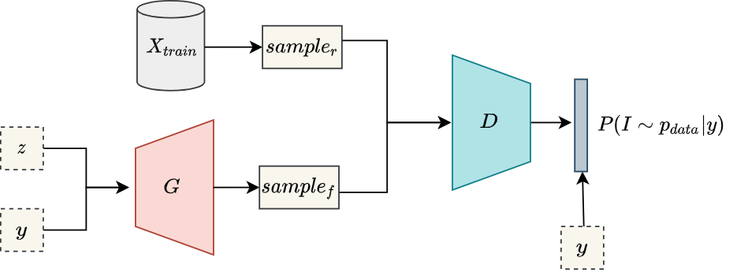
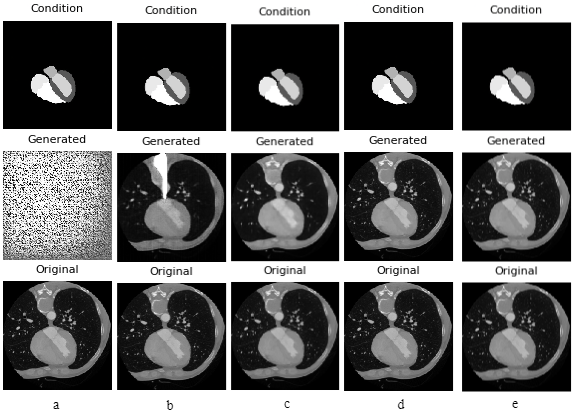

## Generation of Artificial CT Images using Patch-based Conditional Generative Adversarial Networks 

Deep learning has the ability to improve healthcare operations such as diagnosis and prognosis. 
However, the lack of a sufficient number of medical images is the most common barrier to 
deep learning-based image analysis. Due to the scarcity of annotations, semi-supervised techniques 
in computerized medical analysis are receiving considerable interest. 
Artificial data augmentation and creation approaches, such as generative adversarial networks (GANs), 
may assist in overcoming this challenge. Given that, this repository includes implementation of 
our paper on artificial generation of cardiac CT images.

In our work, we presented an image generation approach that uses generative adversarial networks with 
a conditional discriminator where segmentation masks are used as conditions for image generation. 
Illustration of used conditional generative adversarial network (cGAN) is shown below: 

    
We validate the feasibility of GAN-enhanced medical image generation on whole heart 
computed tomography (CT) images and its seven substructures, namely: left ventricle, right ventricle, 
left atrium, right atrium, myocardium, pulmonary arteries, and aorta. Obtained results demonstrate the suitability of the proposed adversarial approach for the accurate 
generation of high-quality CT images. Although paper reports results only for cardiac CT images, implementation is generalized and may easily
be applied for any other image modality and organ. Therefore, the presented method shows great potential to facilitate 
further research in the domain of artificial medical image generation. 

  
### Requirements  

- The implementation uses Keras with TensorFlow backend.
- scikit-image, SimpleITK, and matplotlib are used for data augmentation and 
visualization.
- Training is logged using the Weights & Biases tool ([wandb](www.wandb.com)).

Install the requirements by running

    pip3 install -r requirements.txt

### Dataset

We use the MM-WHS: Multi-Modality Whole Heart segmentation dataset [MMWHS](https://zmiclab.github.io/zxh/0/mmwhs/), 

 

To download the dataset you need to send a signed confidality agreement to dataset providers.
For further instructions on MMWHS dataset download please refer [here](https://zmiclab.github.io/zxh/0/mmwhs/data.html).

    
### Training

To train the model call `main.py` with a config file of your choosing. 
In the `configs/` directory, the config file `whs.json` corresponds to experiment of the paper and uses all 
avaiable labels of the used dataset (i.e., whole heart). 
To use only, e.g., left ventricle and myocardium, one should modify `"LABELS"` in config file to `[0, 1, 3]` 

To train, use following line:

     python3 src/main.py --dataset_path=$DATASETS/whs --config=configs/whs.json
     
Set the environment variable `$DATASET` to be path of your dataset directory.  

### Generated Results

Generated whole heart images, segmentation masks as conditions and their corresponding original images at 
different iterations: a) iteration 0, b) iteration 10000 , c) iteration 25000, d) iteration 50000, 
e) iteration 75000, f) final iteration 100000 are shown below: 

### TODO: citation 

